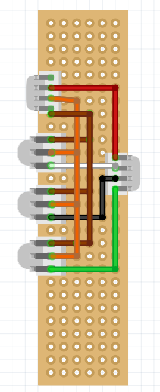
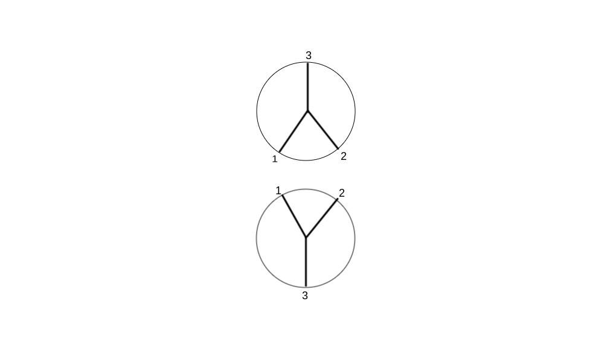

# Helicopter Swash Notes:

## Wiring:

Red: ESC
White: Servo 3
Black:  Servo 2
Green: Servo 1

## Naming convention:

Front:

    CCW
Back:

    CW
## Trims:

Back:

    Servo 3: 1550
    Servo 2: 1550
    Servo 1: 1550
Front:
    
    Servo 1: 1530
    Servo 3: 1530
    Servo 2: 1530 

## Ardupilot Parameter Mapping:

    Front:

        Servo 1: Motor 1, Servo1
        Servo 2: Motor 2, Servo2
        Servo 3: Motor 3, Servo 3
        Front ESC (Servo 4): Motor 4, HeliRSC
    
    Back:
        Servo 5: Motor 5, Servo4
        Servo 6: Motor 6, Servo5
        Servo 7 : Motor 7, Servo6
        Back ESC (Servo 8): Motor 8, HeliRSC

### Ardupilot Servo Function Reference:

    0	Disabled
    31	HeliRSC
    32	HeliTailRSC
    33	Motor1
    34	Motor2
    35	Motor3
    36	Motor4
    37	Motor5
    38	Motor6
    39	Motor7
    40	Motor8
ardu
## Ardupilot Parameters to set
H_SV_MAN 0
FRAME_CLASS 11
H_DUAL_MODE 0
H_SW_TYPE 3
H_SW_COL_DIR 0
H_SW2_TYPE 3
H_SW_COL_DIR 0

SERVO1_FUNCTION 33
SERVO2_FUNCTION 34
SERVO3_FUNCTION 35
SERVO4_FUNCTION 31

SERVO5_FUNCTION 36
SERVO6_FUNCTION 37
SERVO7_FUNCTION 38
SERVO8_FUNCTION 31

RC8_OPT 32
RC7_OPT 31